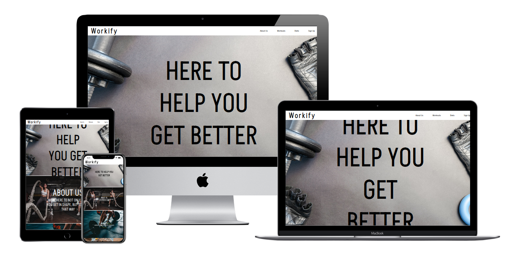
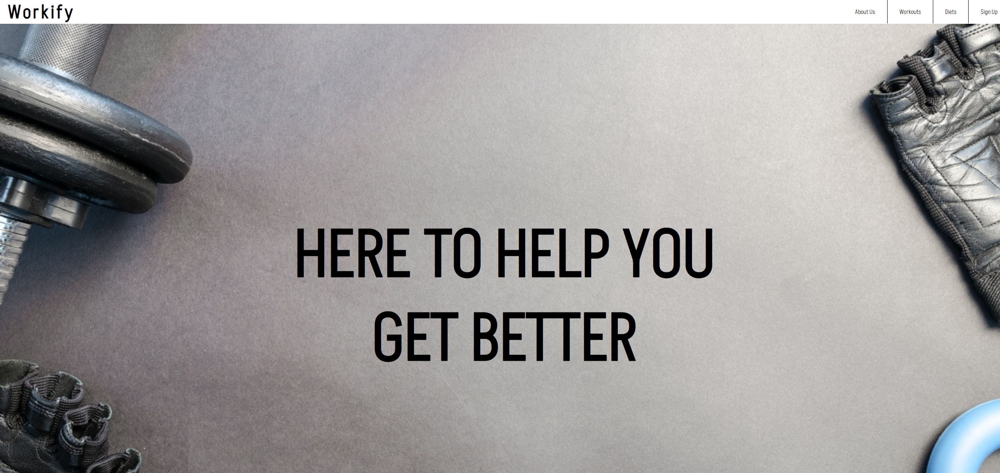
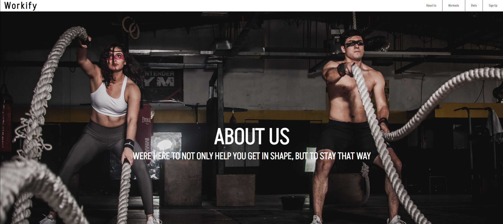
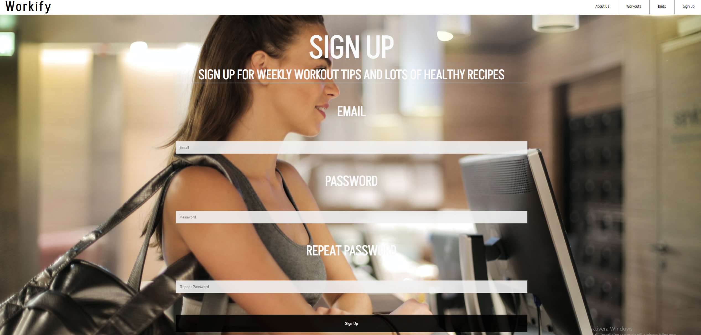
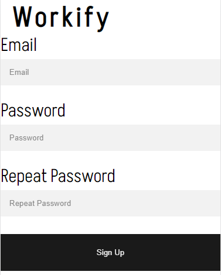

# WORKIFY

### WORKIFY is website where you can sign up for weekly tips and tricks regarding workouts and diets

Workify is a website for those who are looking to get into training and health improvements. Users are able to sign up for weekly workout tips, get lots of healthy recipes and are also able to follow us on all our different social medias.

The live website can be found here; [Workify](https://mattheuskasa.github.io/Workify/)

# Features

## Navigation

- ### Fixed navigation bar includes links to the different sections of the website, making it easy to navigate.
- ### Clicking the logo takes you to the top of the page.

## Header
- ### Introduction to the website, quick and easy way to see what we're about.

## About us Section
- ### A quick introduction about what the website can offer the user.

## Workout Section
- ### Info regarding our workouts

## Diets Section
- ### Info regarding our diets

## Signup Section
- ### Info regarding what you get if you signup.
- ### A signup form consisting of email, password, repeat password and a sign up button.

## Footer
- ### Includes links to social media platforms
- ### All links open in new tabs

## Signup form mobile
- ### On the mobile version the signup form is replaced by a link to a new site with another signup form.

---

# Testing
- ### Tested the website in Chrome and Samsung internet browser for both mobile and desktop.
- ### Tested and confirmed that the website is responsive on all screen sizes using dev tools.
- ### Tested and confirmed that the form works, requires entries in every field and the submit button works.

# Validator Testing
- ## HTML
  - ### No errors were found when passing through the official W3C HTML validator

- ## CSS
  - ### No errors were found when passing through the oficcial W3C CSS validator

- ## Accessibility
  - ### I confirmed that the colours have enough contrast and fonts chosen are easy to read, and all links, icons and images have descriptive text for screen readers running it through Lighthouse in Chrome DevTools.

### Desktop

  

### Mobile

  

  # User Experience

  - ### Mobile users found it difficult to use the signup form, to solve it i changed it to a different page.
  - ### Users found it hard to read the text placed ontop of the images, which were at first black. I fixed this by changing the color of the text to white instead.

  # Bugs and Errors

  - ## Solved

  - ### When adapting the site for mobile i had multiple issues with the signup form not scaling properly, i solved this by providing a link to a different site with the signup form.
  - ### Had problems with the header not following when scrolling, i solved this by giving the header and id and putting the position to fixed.

   ## Unsolved

   ### No unsolved bugs.

---

 # Credits

 - ## Support of documentation in [W3schools.](https://www.w3schools.com/)
 - ## Icons from [Font Awesome.](https://fontawesome.com/)
 - ## Images created and resized using Microsoft Paint.
 - ## Images found at [Pexels](https://www.pexels.com/)