# WORKIFY

## WORKIFY is website where you can sign up for weekly tips and tricks regarding workouts and diets

### Users are able to sign up for weekly workout tips, get lots of healthy recipes and are also able to follow us on all our different social medias.

&nbsp;

## The live website can be found here: [Workify](https://mattheuskasa.github.io/Workify/)

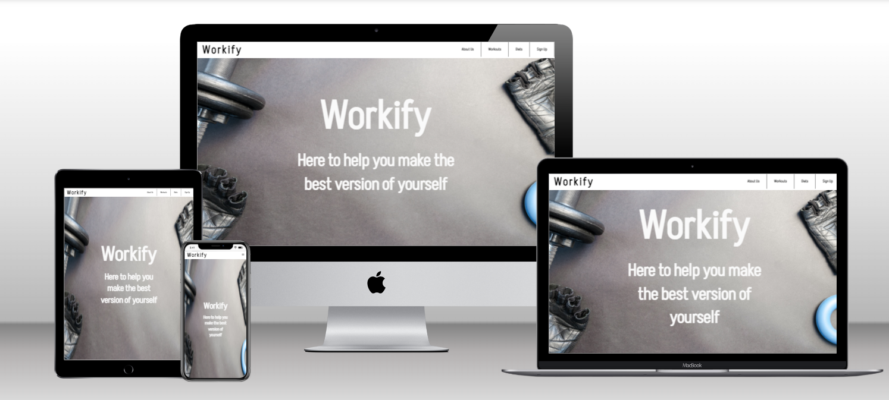

# Table of Contents

1. [Features](#features)
2. [Testing](#testing)
3. [User Experience](#user-experience)
4. [Bugs and Errors](#bugs-and-errors)
5. [Deployment](#deployment)
6. [Credits](#credits)

&nbsp;

# Features

## Navigation

- ### Fixed navigation bar includes links to the different sections of the website, making it easy to navigate.
- ### Clicking the logo takes you to the top of the page.

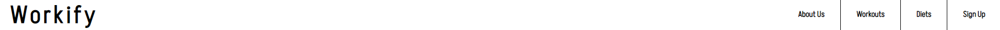

&nbsp;

## About Us header
- ### A welcome page with the name of the website and some motivational text

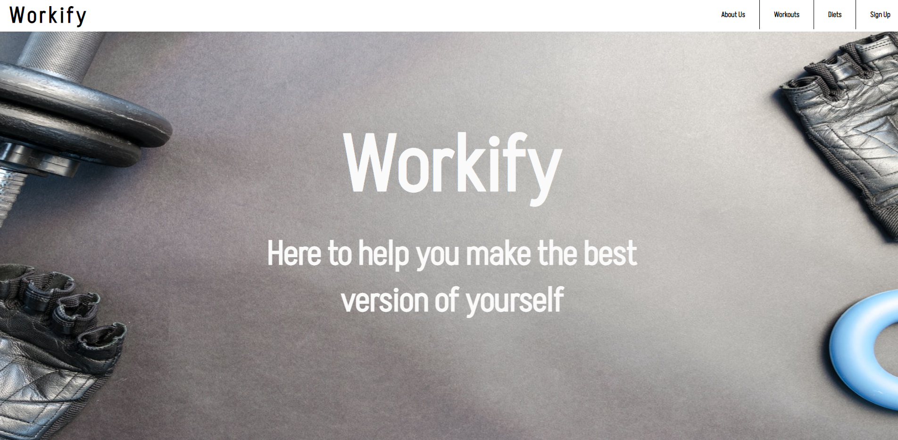

&nbsp;

## About Us section
- ### A quick introduction about what the website can offer the user.

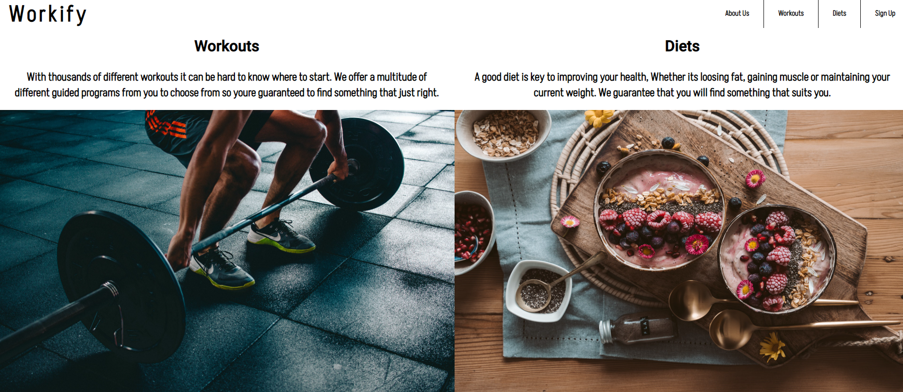

&nbsp;

## Workout Section
- ### Header with the page name and underneath it are two different section with info about what workouts and cardios we offer.

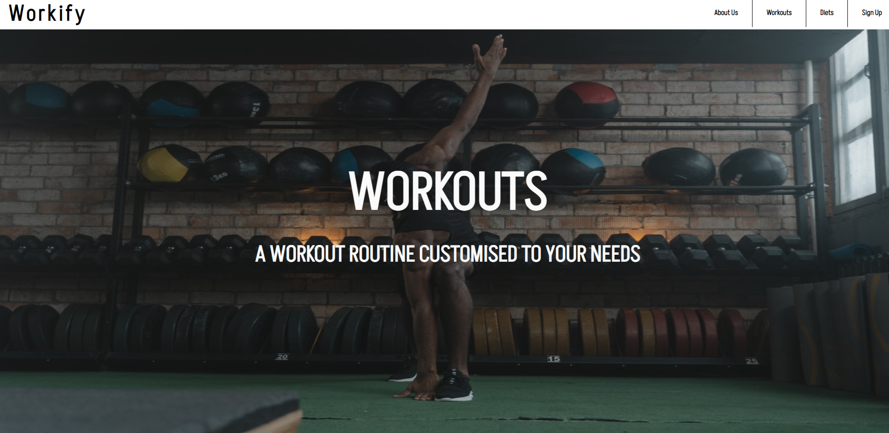
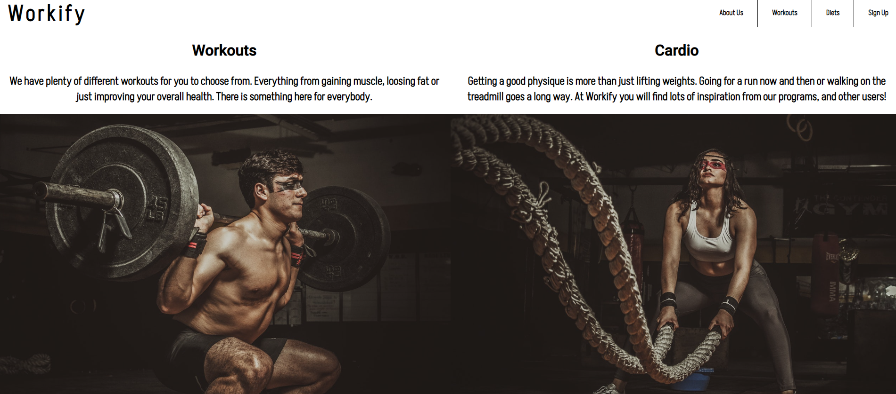

&nbsp;

## Diets Section
- ### Header with the page name and underneath it are two different section with info about what diets and supplement tips we can offer.

&nbsp;

## Signup
- ### Info regarding what you get if you signup.
- ### A signup form consisting of name, email, password, repeat password and a sign up button.

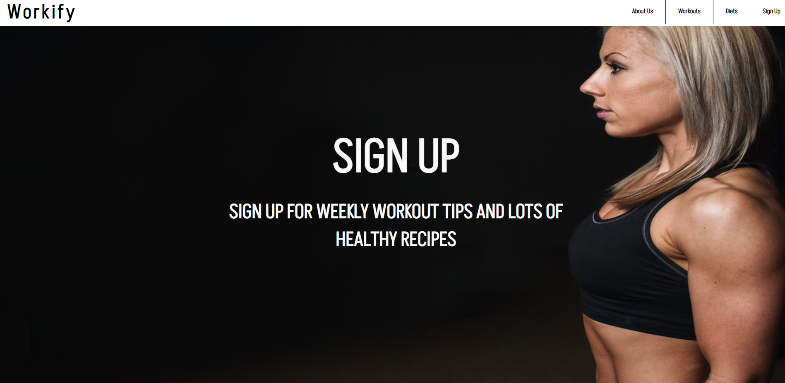
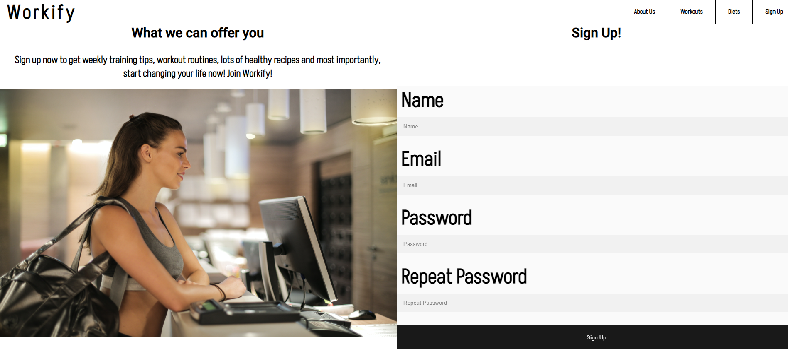

&nbsp;

## Footer
- ### Stick to the bottom of every page
- ### Includes links to social media platforms
- ### All links open in new tabs

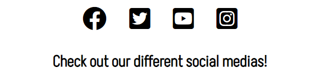

&nbsp;

---

# Testing
- ### Tested the website in Chrome and Samsung internet browser for both mobile and desktop.
- ### Tested and confirmed that the website is responsive on all screen sizes using dev tools.
- ### Tested and confirmed that the form works, requires entries in every field and the submit button works.

&nbsp;

# Validator Testing
- ## HTML
  - ### No errors were found when passing through the official W3C HTML validator

- ## CSS
  - ### No errors were found when passing through the oficcial W3C CSS validator

- ## Accessibility
  - ### I confirmed that the colours have enough contrast and fonts chosen are easy to read, and all links, icons and images have descriptive text for screen readers running it through Lighthouse in Chrome DevTools.
&nbsp;
### Desktop

  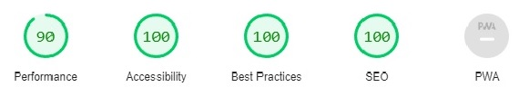

### Mobile

  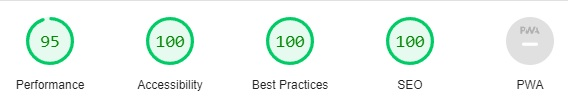

  &nbsp;

  # User Experience

  - ### Mobile users found it difficult to use the signup form, to solve it i changed it to a different page.
  - ### Users found it hard to read the text placed ontop of the images, which were at first black. I fixed this by changing the color of the text to white instead.

  &nbsp;

  # Bugs and Errors

  - ## Solved

  - ### When adapting the site for mobile i had multiple issues with the signup form not scaling properly, i solved this by putting the form under the image next to it when on mobile.
  - ### Had problems with the header not following when scrolling, i solved this by giving the header and id and putting the position to fixed.
  - ### Accesibility was at 80% due to the size of the images. I solved this by replacing all the images of ones with a lower resolution.

  - ## Unsolved

  - ### No unsolved bugs.

  &nbsp;

  # Deployment 
  
  ## The site was deployed to GitHub Pages with the following steps:

  - ## Click on the "Settings" tab in the Github repository for the project.
  - ## Click on the "Pages" section of the menu on the left.
  - ## Under "Source", select "Branch:main and hit save.
  - ## The site should be deployed succesfully after a few minutes and the link can be clicked and lead you to the website.

  &nbsp;

 # Credits

 - ## Support of documentation in [W3schools.](https://www.w3schools.com/)
 - ## Icons from [Font Awesome.](https://fontawesome.com/)
 - ## Images created and resized using Microsoft Paint.
 - ## Images found at [Pexels](https://www.pexels.com/)
 - ## Wireframe mockup made in [Figma](https://www.figma.com/file/cYqfyPLuKfsHz5zADpx0mM/Untitled?node-id=0%3A1)
 - ## Mockup for multiple screensizes from [Techsini](http://techsini.com/multi-mockup/index.php)